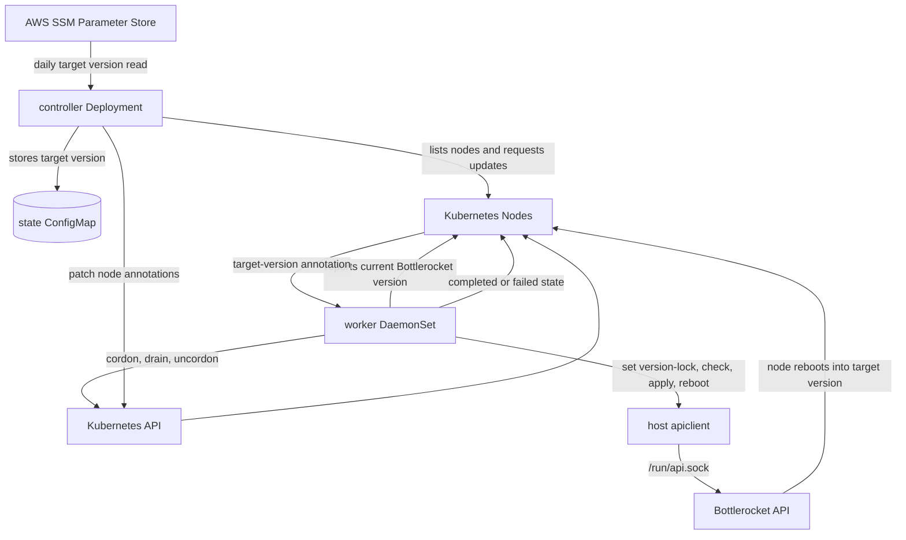

# Bottlerocket Updater

Small Kubernetes updater for Bottlerocket nodes.

It is intentionally separate from Brupop. The controller reads a user-defined AWS SSM Parameter Store parameter once per day, and workers apply that value as `settings.updates.version-lock` on Bottlerocket nodes before running the local `apiclient` update workflow.

## Architecture



- `controller` Deployment:
  - reads the configured SSM parameter once per day
  - stores the desired Bottlerocket version in a ConfigMap
  - schedules node updates only inside the configured maintenance window
  - limits rollout concurrency with `rollout.maxConcurrentUpdates`

- `worker` DaemonSet:
  - runs on Bottlerocket nodes
  - mounts the host `/run/api.sock` and `/bin/apiclient`
  - cordons and drains the node through the Kubernetes API
  - waits `excludeFromLbWaitTimeInSec` after drain
  - applies `settings.updates.version-lock`
  - runs `apiclient update check`, `apiclient update apply`, and `apiclient reboot`
  - uncordons the node after it returns on the target version

## Helm values

```yaml
image:
  repository: public.ecr.aws/example/bottlerocket-updater
  tag: "0.1.0"

aws:
  region: us-east-1
  parameterStore:
    parameterName: "/my/team/approved-bottlerocket-version"

schedule:
  timeZone: UTC
  updateWindowStart: "01:00"
  rolloutStart: "02:30"
  updateWindowEnd: "05:00"

rollout:
  maxConcurrentUpdates: 1
  excludeFromLbWaitTimeInSec: "0"

targetNodeLabelSelector: "node.kubernetes.io/os=linux"
```

The SSM parameter name is fully user-defined. The parameter value must be an explicit Bottlerocket version such as `v1.60.0`.

If the window closes before all nodes are updated, the controller keeps the remaining nodes pending and continues during the next maintenance window.

## IAM

The controller ServiceAccount needs permission to read the configured parameter, for example:

```json
{
  "Effect": "Allow",
  "Action": "ssm:GetParameter",
  "Resource": "arn:aws:ssm:REGION:ACCOUNT_ID:parameter/my/team/approved-bottlerocket-version"
}
```

Use IRSA or another AWS SDK credential provider supported in your cluster.

## Rollback behavior

Before reboot, failures trigger a best-effort `deactivate-update` and the worker uncordons the node.

After reboot, Bottlerocket's own boot process can roll back if the updated partition cannot boot. The worker marks the node failed and uncordons it if the node returns without reaching the target version.
